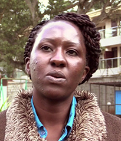
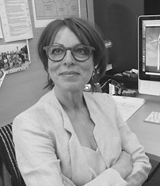
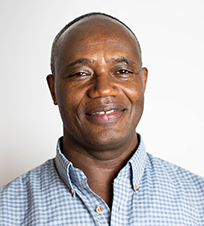
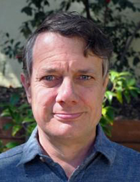
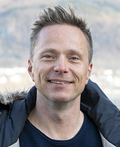
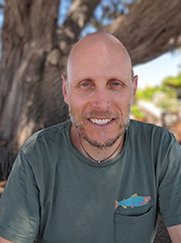
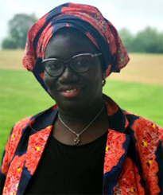

	
## _DOWN2EARTH_ Advisory Board Members 

{:class="img-responsive"} 
[Maurine Ambani]()

{:class="img-responsive"} 
[Roberta Boscolo]()

{:class="img-responsive"} 
[Tufa Dinku]()

{:class="img-responsive"} 
[Chris Funk]()

{:class="img-responsive"} 
[Erik Kolstad]()

{:class="img-responsive"} 
[Michael Bliss Singer]()

{:class="img-responsive"} 
[Arame Tall]()

 <a href="https://ec.europa.eu/programmes/horizon2020/en">
         <a href="https://cordis.europa.eu/project/id/869550">An EU Horizon 2020 Project funded under grant agreement No 869550</a>