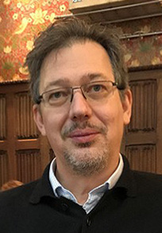
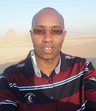
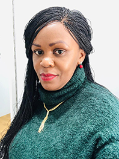

  
  

# _DOWN2EARTH_ Team  

## Cardiff University (CU) <a href="https://cardiff.ac.uk">

{:class="img-responsive"} 
[Michael Bliss Singer](), _DOWN2EARTH_ Principal Investigator and CU Principal Investigator

{:class="img-responsive"} 
[Toby Pitts](), _DOWN2EARTH_ Project Manager 

{:class="img-responsive"} [Mark Cuthbert](), [Model Development Team](../model_development)

{:class="img-responsive"} [Owen Jones](), [Model Development Team](../model_development)

{:class="img-responsive"} 
[David MacLeod](), [Climate/Water Data Team](../climate_water_data) 

{:class="img-responsive"} 
[Andrés Quichimbo](), Postdoctoral Researcher, [Model Development Team](../model_development)

{:class="img-responsive"} 
[Manuel Rios Gaona](), Postdoctoral Researcher, [Model Development Team](../model_development)

{:class="img-responsive"} 
[Katherine Cocking](), PhD Student, [Climate/Water Data Team](../climate_water_data) 

## University of Bristol (UoB) <a href="https://bristol.ac.uk">

{:class="img-responsive"} 
[Katerina Michaelides](), UoB Principal Investigator, [Climate/Water Data Team](../climate_water_data)  

{:class="img-responsive"} 
[Rafael Rosolem](), [Climate/Water Data Team](../climate_water_data) 

{:class="img-responsive"} 
[Dann Mitchell](), [Climate/Water Data Team](../climate_water_data)  

{:class="img-responsive"} 
[Dagmawi Asfaw](), Postdoctoral Researcher, [Climate/Water Data Team](../climate_water_data) 

{:class="img-responsive"} 
[Isaac Kipkemoi](), PhD Student, [Climate/Water Data Team](../climate_water_data) 

{:class="img-responsive"} 
[George Blake](), PhD Student, [Climate/Water Data Team](../climate_water_data) 

{:class="img-responsive"} 
[Jacob Rigby](), Postdoctoral Researcher, [App Development Team](../app_development) 

{:class="img-responsive"} 
[Kieren Pitts](), [App Development Team](../app_development) 

{:class="img-responsive"} 
[Chris Preist](), [App Development Team](../app_development)  

{:class="img-responsive"} 
[Dan Schien](), [App Development Team](../app_development)  

## Vrije Universiteit Amsterdam - Institute for Environmental Studies (IVM-VU) <a href="https://research.vu.nl/en/">

{:class="img-responsive"} 
[Anne van Loon](), IVM-VU Principal Investigator, [Model Development Team](../model_development)  

{:class="img-responsive"} 
[Jeroen Aerts](), [Model Development Team](../model_development) 

{:class="img-responsive"} 
[Toon Haer](), [Model Development Team](../model_development) 

{:class="img-responsive"} 
[Ileen Streefkerk](), PhD Student, [Model Development Team](../model_development) 

{:class="img-responsive"} 
[Teun Schrieks](), PhD Student, [Model Development Team](../model_development) 

{:class="img-responsive"} 
[Rhoda Odongo](), PhD Student, [Model Development Team](../model_development) 

{:class="img-responsive"} 
[Tim Busker](), PhD Student, [Model Development Team](../model_development) 

## Unviversity of Ghent (UGent) <a href="https://www.ugent.be/en">

{:class="img-responsive"} 
[Diego Miralles](), UGent Principal Investigator, [Climate/Water Data Team](../climate_water_data) 

{:class="img-responsive"} 
[Akash Koppa](), Postdoctoral Researcher, [Climate/Water Data Team](../climate_water_data) 

{:class="img-responsive"} 
[Jessica Keune](), Postdoctoral Researcher, [Climate/Water Data Team](../climate_water_data) 

{:class="img-responsive"} 
[Jeroen Claessen](), PhD Student, [Climate/Water Data Team](../climate_water_data) 

## University of East Anglia (UEA) <a href="https://www.uea.ac.uk/">

{:class="img-responsive"} 
[Roger Few](), UEA Principal Investigator, [Community Research, Engagement, & Impact Team](../community_research_engagement_&_impact) 

{:class="img-responsive"} 
[Mark Tebboth](), [Community Research, Engagement, and Impact Team](../community_research_engagement_&_impact) 

## Aalborg University (Aalborg-PLAN) <a href="https://www.en.aau.dk/">

{:class="img-responsive"} 
[Maike Schumacher](), Aalborg-PLAN Principal Investigator, [Climate/Water Data Team](../climate_water_data) 

{:class="img-responsive"} 
[Ehsan Forootan](), [Climate/Water Data Team](../climate_water_data) 

{:class="img-responsive"} 
[Nooshin Mehrnegar](), Postdoctoral Researcher, [Climate/Water Data Team](../climate_water_data) 

## IGAD Climate Prediction and Applications Centre (ICPAC) <a href="https://www.icpac.net/">

{:class="img-responsive"} 
[Abebe Tadege](), ICPAC Principal Investigator, [Dissemination and Communication Team](../dissemination_communication) 

{:class="img-responsive"} 
[George Otieno](), [Dissemination and Communication Team](../dissemination_communication) 

{:class="img-responsive"} 
[Khalid Hassaballah](), [Climate/Water Data Team](../climate_water_data) 

## Action Aid International (AA) <a href="https://actionaid.org/">

{:class="img-responsive"} 
[Zahra Hdidou](), AA Principal Investigator, [Community Research, Engagement, and Impact Team](../community_research_engagement_&_impact) 

{:class="img-responsive"} 
[Hosea Kandagor](), [Community Research, Engagement, and Impact Team](../community_research_engagement_&_impact) 

{:class="img-responsive"} 
[Hashi Hassan](), [Community Research, Engagement, and Impact Team](../community_research_engagement_&_impact) 

{:class="img-responsive"} 
[Ahmed Aden](), [Community Research, Engagement, and Impact Team](../community_research_engagement_&_impact) 

{:class="img-responsive"} 
[Cynthia Asafi Wechabe](), [Community Research, Engagement, and Impact Team](../community_research_engagement_&_impact) 

## UN Food and Agriculture Organization - Somalia Water And Land Information Management (FAO-SWALIM) <a href="http://www.faoswalim.org/"> 

{:class="img-responsive"} 
[Paolo Paron](), FAO-SWALIM Principal Investigator, [Climate/Water Data Team](../climate_water_data) 

{:class="img-responsive"} 
[Flavian Muthusi](), [Climate/Water Data Team](../climate_water_data) 
   
## Climate Analytics (CA) <a href="https://climateanalytics.org/"> 

{:class="img-responsive"} 
[Inga Menke](), CA Principal Investigator, [Policy Development Team](../policy_development) 

{:class="img-responsive"} 
[Winnie Khaemba](), [Policy Development Team](../policy_development) 

{:class="img-responsive"} 
[Raghuveer Vyas](), [Policy Development Team](../policy_development) 

## BBC Media Action (BBC-MA) <a href="https://www.bbc.co.uk/mediaaction"> 

{:class="img-responsive"} 
[Lynn Morris](), BBC-MA Principal Investigator, [Dissemination and Communication Team](../dissemination_communication) 

{:class="img-responsive"} 
[Diana Njeru](), [Dissemination and Communication Team](../dissemination_communication) 

## Transparency Solutions (TS) <a href="https://transparencysolutions.com/"> 

{:class="img-responsive"} 
[Latif Ismail](), TS Principal Investigator, [Policy Development Team](../policy_development) 

{:class="img-responsive"} 
[Mustafe Elmi](), TS Principal Investigator, [Policy Development Team](../policy_development) 

## University of Nairobi (UoN) <a href="https://www.uonbi.ac.ke/"> 

{:class="img-responsive"} 
[Oliver Wasonga](), UoN Principal Investigator, [Community Research, Engagement, and Impact Team](../community_research_engagement_&_impact) 

## Addis Ababa University (AAU) <a href="http://www.aau.edu.et/"> 

{:class="img-responsive"} 
[Mohammed Assen](), AAU Principal Investigator, [Community Research, Engagement, and Impact Team](../community_research_engagement_&_impact) 

{:class="img-responsive"} 
[Asmamaw Legass](), [Community Research, Engagement, and Impact Team](../community_research_engagement_&_impact)  

## Organization for Social Science Research in Eastern and Southern Africa (OSSREA) <a href="https://www.ossrea.net/"> 

{:class="img-responsive"} 
[Mohammed Assen](), OSSREA Principal Investigator, [Community Research, Engagement, and Impact Team](../community_research_engagement_&_impact) 

{:class="img-responsive"} 
[Asmamaw Legass](), [Community Research, Engagement, and Impact Team](../community_research_engagement_&_impact)  

## DOWN2EARTH Alumni 

{:class="img-responsive"} 
[Sophie Rigg](), AA Principal Investigator, [Community Research, Engagement, and Impact Team](../community_research_engagement_&_impact) 

{:class="img-responsive"} 
[Peris Muchiri](), Former FAO-SWALIM Principal Investigator, [Climate/Water Data Team](../climate_water_data) 

{:class="img-responsive"} 
Ali Cotton, Former _DOWN2EARTH_ Project Manager

{:class="img-responsive"} 
Tsegaw Lencha, Former member of [Community Research, Engagement, and Impact Team](../community_research_engagement_&_impact) 

{:class="img-responsive"} 
Amiera Sawas, Former AA Principal Investigator, [Community Research, Engagement, and Impact Team](../community_research_engagement_&_impact) 

 <a href="https://ec.europa.eu/programmes/horizon2020/en">
         <a href="https://cordis.europa.eu/project/id/869550">An EU Horizon 2020 Project funded under grant agreement No 869550</a>